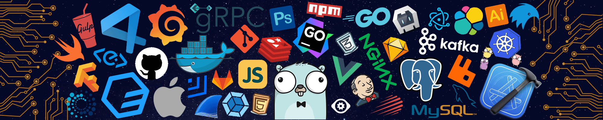

    
    
    
    
    
    

> <b>I'm a Software Developer who is a highly motivated person with strong technical, problem-solving with excellent time management, leadership, and team skills who is likely to create an impact on the organization/work, I'm a part of and always loves to socialize and experience new things in life.</b>

## 🛠️ Tech Stack:
&nbsp;
&nbsp;
&nbsp;
&nbsp;
&nbsp;
&nbsp;
\
&nbsp;
&nbsp;

<tr>
        <td align="center"></td>
    </tr>
    <tr>
        <td colspan="2" align="center"></td>
    </tr>
